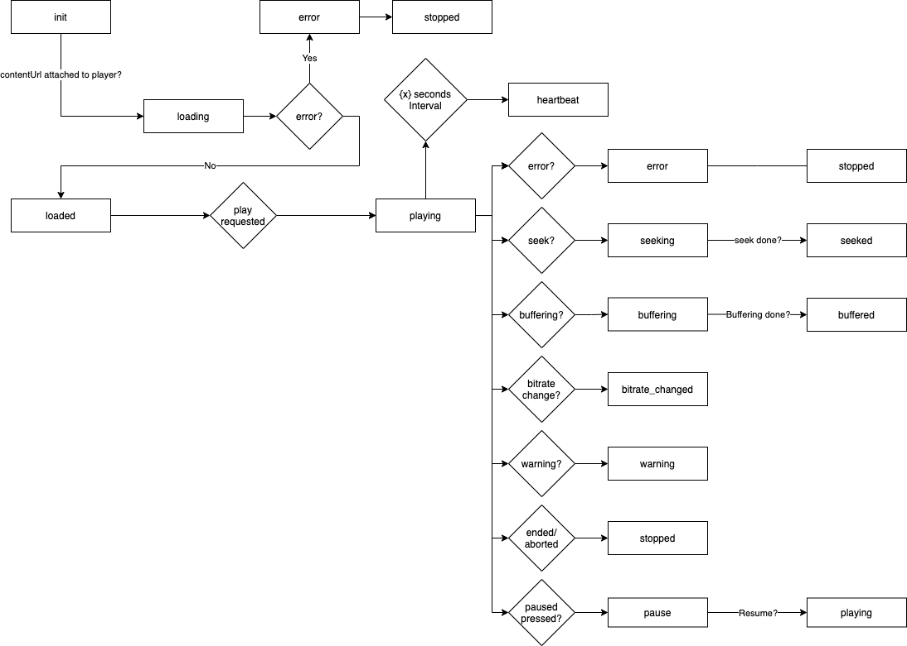

# Version 0.2

## Supported playback scenarios 

✅ - Fully supported
⚠️ - Partially supported
🚫 - Not supported

| Scenario                 | Support |
|:-------------------------|:--------|
| VOD                      | ✅      |
| Live Events              | ⚠️      |
| Live channels            | ⚠️      |
| Server-side Ad insertion | 🚫      |
| Client-side Ad insertion | 🚫      |

## Terminology

`session` - A session means the viewing session of a piece of content.

`sessionId` - Refers to the unique identifier for a viewing session of a piece of  content.

`event` - Refers to a set of data that corresponds to the viewing experience.

## Event flow

An analytics specification needs a reliable event flow, it is crucial that the following events are implemented correctly for the backend to be able to churn out session data.

### JSON Schema

```jsonc
{
  event: "event_enum",
  sessionId: "UID" 
  timestamp: 1634911668339, // UTC time. The client SHOULD send valid UTC time.

  playhead: 0, // The current playhead position in milliseconds, if the content is Live should be UTC time. -1 if unknown
  duration: 0, // The duration of the content in milliseconds. VOD = length of stream, Live = live edge in UTC. -1 if unknown 
  payload?: {
    // Unique to each event
    // If needed additional custom fields may be added here as well but the server MAY ignore them. 
  }
}
```

### Flowchart



### Events

#### init

Sent when the client knows it should start a viewing session of content.

This SHOULD be the first event sent by the client to the server.

A restart of content SHOULD create a new session.

The server SHOULD handle events arriving out of order. Each event carries a `sessionId` and a `timestamp` for ordering in post.

MUST be sent ONCE per session.

MUST be a unique sessionId.

```jsonc
{
  event: "init",
  sessionId: "",
  timestamp: -1,
  playhead: -1, // if the player has an expected startTime, eg. if user continues watching a movie, use that value here.
  duration: -1,
  payload: {
    live: false,
    contentId: "",
    contentUrl: "",
    drmType?: "",
    userId?: "", 
    deviceId?: ""
    deviceModel?: ""
    deviceType?: ""
    ... // additional parameters can be added as needed, however the server may choose to ignore them.
  }
}
```

#### heartbeat

Sent on an interval, if a certain number of heartbeat events are missing the server can close a session without receiving a stopped event. 

MUST be sent at a fixed interval.

The interval SHOULD be agreed upon between client and server.

```jsonc
{
  event: "heartbeat",
  sessionId: "",
  timestamp: 0,
  playhead: 0,
  duration: 0,
  payload?: {
  }
}
```
 
#### loading

Sent when the contentUrl has been attached to the client player.

MUST be sent ONCE per session.

```jsonc
{
  event: "loading",
  sessionId: "",
  timestamp: 0,
  playhead: 0,
  duration: 0,
}
```


#### loaded

Sent when there is enough buffered content for the player to start playing the content.

MUST be sent ONCE per session.

```jsonc
{
  event: "loaded",
  sessionId: "",
  timestamp: 0,
  playhead: 0,
  duration: 0
}
```

#### playing

Sent when playback starts or resumes, when the playhead starts to move.

```jsonc
{
  event: "playing",
  sessionId: "",
  timestamp: 0,
  playhead: 0,
  duration: 0
}
```

#### paused

Sent when the player is paused due to a pause request. 

Should not be sent when playback stops for other reasons, e.g. buffering or seeking.

```jsonc
{
  event: "paused",
  sessionId: "",
  timestamp: 0,
  playhead: 0,
  duration: 0
}
```

#### buffering

Sent when the player starts buffering. Buffering that happens when seeking or loading should be ignored.

Note, since it is possible to pause and unpause during buffering, the corresponding `playing` should not trigger until after `buffered`, since that is when the playhead can start moving again.

```jsonc
{
  event: "buffering",
  sessionId: "",
  timestamp: 0,
  playhead: 0,
  duration: 0
}
```

#### buffered

Sent when the player has finished buffering.

If the buffering is interrupted, for example by `seeking` or `stopped`, `buffered` should NOT be sent.

```jsonc
{
  event: "buffered",
  sessionId: "",
  timestamp: 0,
  playhead: 0,
  duration: 0
}
```

#### seeking

Sent when the player starts seeking to a new playhead time. 

The `playhead` MUST be the current playhead time NOT the target playhead time.

Note, since it is possible to pause and unpause during seeking, the corresponding `playing` should not trigger until after `seeked`, since that is when the playhead can start moving again.

MUST not be sent during `loading`.

```jsonc
{
  event: "seeking",
  sessionId: "",
  timestamp: 0,
  playhead: 0, // the current playhead
  duration: 0
}
```

#### seeked

Sent when the player has finished seeking to the new playhead time and is ready to start playing.

`playhead` MUST be the new playhead time.

```jsonc
{
  event: "seeked",
  sessionId: "",
  timestamp: 0, // the new playhead
  playhead: 0,
  duration: 0
}
```

#### bitrate_changed

Sent when the player successfully switches to a new bitrate.

```jsonc
{
  event: "bitrate_changed",
  sessionId: "",
  timestamp: 0,
  playhead: 0,
  duration: 0,
  payload: {
    bitrate: "", // bitrate in Kbps
    width?: "", // video width in pixels
    height?: "", // video height in pixels
    videoBitrate?: "", // if available provide the bitrate for the video track
    audioBitrate?: "", // if available provide the bitrate for the audio track
  }
}
```

#### stopped

Sent when playback stops.

```jsonc
{
  event: "stopped",
  sessionId: string,
  timestamp: 0,
  playhead: 0,
  duration: 0,
  payload: {
    reason: "", // eg. "ended", "aborted", "error"
  }
}
```

#### error

Sent when a fatal error occurs. 

The following `stopped` event SHOULD be sent with `reason: "error"`.

```jsonc
{
  event: "error",
  sessionId: "",
  timestamp: 0,
  playhead: 0,
  duration: 0,
  payload: {
    category?: "", // eg. NETWORK, DECODER, etc.
    code: "",
    message?: "", 
    data?: {} 
  }
}
```

#### warning

Sent when a non-fatal error occurs. 

A playback error that the player can recover from without interruption.

```jsonc
{
  event: "warning",
  sessionId: "",
  timestamp: 0,
  playhead: 0,
  duration: 0,
  payload: {
    category?: "", // eg. NETWORK, DECODER, osv.
    code "",
    message?: "",
    data?: {} 
  }
}
```
