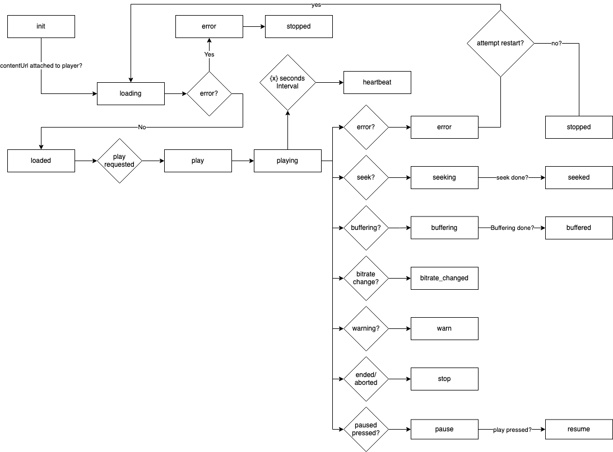

# Version 0.1

## Supported playback scenarios 

✅ - Fully supported
⚠️ - Partially supported
🚫 - Not supported

| Scenario                 | Support |
|:-------------------------|:--------|
| VOD                      | ✅      |
| Live Events              | ⚠️      |
| Live channels            | ⚠️      |
| Server-side Ad insertion | 🚫      |
| Client-side Ad insertion | 🚫      |

## Terminology

`session` - A session means the viewing session of some particular content so `sessionId` refers to the unique viewing session of some content.

## Event flow

Any analytics specification needs a solid & reliable event flow, it is crucial that the following events are implemented correctly for the backend to reliably be able to churn out good session data.

All events except `heartbeat` & `stopped` SHOULD be batched together and sent with the `hearbeat` & `stopped` event. Batched events MUST be re-sent in case of network failure.

### JSON Schema

Single event
```jsonc
{
  event: "event_enum",
  sessionId: "UID" 
  timestamp: 1634911668339, // UTC time. The client SHOULD send valid UTC time.

  playhead: 0, // The current playhead position in milliseconds, if the content is Live should be UTC time. -1 if unknown
  duration: 0, // The duration of the content in milliseconds. VOD = length of stream, Live = live edge in UTC. -1 if unknown 
  payload?: {
    // Unique to each event
    // If needed additional custom fields may be added here as well but the server MAY ignore them. 
  }
}
```

Batched events in heartbeat/stopped
```jsonc
{
  event: "heartbeat", // or "stopped"
  sessionId: "UID",
  timestamp: 1634911668339, // UTC time. The client SHOULD send valid UTC time.

  playhead: 0, // The current playhead position in milliseconds, if the content is Live should be UTC time. -1 if unknown
  duration: 0, // The duration of the content in milliseconds. VOD = length of stream, Live = live edge in UTC. -1 if unknown 
  payload: {
    events: [{
      // include all events here
    }],
    ... // the other stopped/hearbeat payload fields
  } 
}
```

See the full [schema](schema/0.1.schema.json)

### Flowchart



### Events

#### init

Sent just before the player starts loading the contentUrl.
MUST be sent ONCE per session. CANNOT be batched

```jsonc
{
  event: "init",
  sessionId?: "" // if not provided the server MUST generate it
  timestamp: -1,
  playhead: -1, // if the player has an expected startTime, eg. if user continues watches a movie, use that value here.
  duration: -1,
  payload: {
    live: false,
    contentId: "",
    contentUrl: "",
    drmType?: "",
    userId?: "", 
    deviceId?: ""
    deviceModel?: ""
    deviceType?: ""
    ... // additional parameters can be added as needed, however the server may choose to ignore them.
  }
}
```

The `init` event is the only event that actually receives a JSON response from the server
```jsonc
{
  sessionId: ''
  heartbeatInterval: 30, 
}
```

After the init response the client MUST send the heartbeat event at the provided interval, until the session has ended.

#### heartbeat

Sent at a fixed interval using the provided value from the `init` event response.

```jsonc
{
  event: "heartbeat",
  sessionId: "",
  timestamp: 0,
  playhead: 0,
  duration: 0,
  payload?: {
    events?: [{
      ... // batched events if any
    }]
  }
}
```
 
#### loading

Sent when the contentUrl has been attached to the client player.
MUST be sent ONCE per session.

```jsonc
{
  event: "loading",
  sessionId: "",
  timestamp: 0,
  playhead: 0,
  duration: 0
}
```


#### loaded

This is sent when there is enough buffered content for the player to play the contentUrl.
MUST be sent ONCE per session.

```jsonc
{
  event: "loaded",
  sessionId: "",
  timestamp: 0,
  playhead: 0,
  duration: 0
}
```

#### play

Sent as soon as player request that playback starts, eg. when the user presses play or when autoplay kicks in.
MUST be sent ONCE per session.

```jsonc
{
  event: "play",
  sessionId: "",
  timestamp: 0,
  playhead: 0,
  duration: 0
}
```


#### playing

Sent when playback starts, when the playhead starts to move.
MUST be sent ONCE per session.

```jsonc
{
  event: "playing",
  sessionId: "",
  timestamp: 0,
  playhead: 0,
  duration: 0
}
```


#### pause

Sent when the player is paused due to a pause request ( not because the playhead stopped moving )

```jsonc
{
  event: "pause",
  sessionId: "",
  timestamp: 0,
  playhead: 0,
  duration: 0
}
```

#### resume

Sent when the player resume playback after a pause.

```jsonc
{
  event: "resume",
  sessionId: "",
  timestamp: 0,
  playhead: 0,
  duration: 0
}
```

#### buffering

Sent when the player starts buffering. Any buffering that happens when seeking or loading should not be sent as `buffering`.

```jsonc
{
  event: "buffering",
  sessionId: "",
  timestamp: 0,
  playhead: 0,
  duration: 0
}
```

#### buffered

Sent when the player resumes playback after buffering. If the buffering is interrupted `buffered` should NOT be sent. 

```jsonc
{
  event: "buffered",
  sessionId: "",
  timestamp: 0,
  playhead: 0,
  duration: 0
}
```

#### seeking

This is sent when the player starts seeking to a new playhead time. `playhead` MUST be the current playhead time NOT the target playhead time. Should not be sent during `loading`.

```jsonc
{
  event: "seeking",
  sessionId: "",
  timestamp: 0,
  playhead: 0,
  duration: 0
}
```

#### seeked

Sent when the player starts seeking to a new playhead time. `playhead` MUST be new playhead time.

```jsonc
{
  event: "seeked",
  sessionId: "",
  timestamp: 0,
  playhead: 0,
  duration: 0
}
```

#### bitrate_changed

Sent when the player switches between different ABR levels.

```jsonc
{
  event: "bitrate_changed",
  payload: {
    bitrate: "", // bitrate in Kbps
    width?: "", // video width in pixels
    height?: "", // video height in pixels
    videoBitrate?: "", // if available provide the bitrate for the video track
    audioBitrate?: "", // if available provide the bitrate for the audio track
  }
}
```

#### stopped

Sent when playback stops for whatever reason.

```jsonc
{
  event: "stopped",
  payload: {
    reason?: "", // eg. "ended", "aborted", "error"
    events?: [{
      ... // batched events if any
    }]
  }
}
```

#### error

Sent when a fatal error occurs, if the player does not recover from this error the `stopped` event SHOULD be sent with `reason: "error"`.

```jsonc
{
  event: "error",
  payload: {
    category?: "", // eg. NETWORK, DECODER, etc.
    code: "",
    message?: "", 
    data?: {} 
  }
}
```

#### warn

Sent when a non-fatal error occurs, eg. a subtitle track doesn't work but the player is still able to play the content or a playback error that the player can recover
from without interruption.

```jsonc
{
  event: "warn",
  payload: {
    category?: "", // eg. NETWORK, DECODER, osv.
    code "",
    message?: "",
    data?: {} 
  }
}
```
